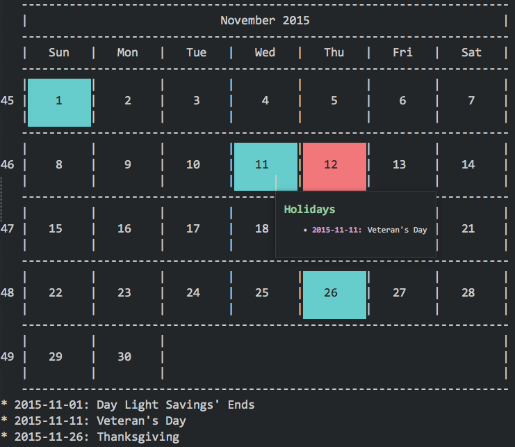

[![Build][github-ci-image]][github-ci-link]
[![Package Control Downloads][pc-image]][pc-link]
![License][license-image]
# QuickCal

Sublime Text plugin for viewing a quick, simple month calendar.

# Features
- Supports holidays downloaded from holidata.net.
- Can show weeks starting with Monday or Sunday.
- Shows week numbers for the year.

# Documentation
https://facelessuser.github.io/QuickCal/

# Thanks

- [@kauinoa](https://github.com/kauinoa): [`calendarevents`](https://github.com/kauinoa/CalendarEvents)

# License
QuickCal is released under the MIT license.

[github-ci-image]: https://github.com/facelessuser/QuickCal/workflows/build/badge.svg
[github-ci-link]: https://github.com/facelessuser/QuickCal/actions?workflow=build
[pc-image]: https://img.shields.io/packagecontrol/dt/QuickCal.svg?logo=sublime%20text&logoColor=ccccc
[pc-link]: https://packagecontrol.io/packages/QuickCal
[license-image]: https://img.shields.io/badge/license-MIT-blue.svg
